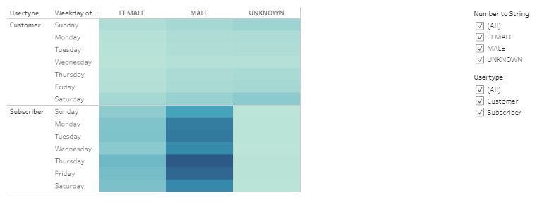

# BikeSharing (using Tableau)
## Overview of Project/Purpose
In this week's challenge the purpose was to use our analytical skills to create a dashboard/story
using visualizations created in Tableau. For this exercise, it's aim is to analyze a bike-sharing program
called CitiBikes in NYC and convince investors it's a solid business proposal. With this dashboard, stakeholders
can make a decision how it would fare in a possible location. 

---
## Analysis/Results

**Jupyter Notebook**: Pulling real data from https://www.citibikenyc.com/system-data , the information was converted into a `.csv` file.
As such, this file is what was read into the jupyter notebook. Modifying one of the datatypes, it allowed us to create a new `.csv` file.
This new file is what got read into Tableau.

**Tableau Charts/Visualizations**: In tableau, we created 5 different types of charts and adding two additional charts.
The seven total visualizations can be accessed here in Tableau Public as a story: [NYC CitiBikes Dashboard](https://public.tableau.com/profile/janine.yoro#!/vizhome/CitiBikeChallenge_16142245131870/NYCCitiBikeStory?publish=yes)

In the challenge it called for these five charts first: 

Here this graph shows the length of time that bikes are checked for all riders. The tripduration is broken up into hours. As we can see in the chart,
most riders tend to ride for less than an hour. It seems that a majority of the bikes checked out had a trip duration less than 20 minutes.  

This graph is an extended version of the chart above. It shows the length of time that bikes are checked out for each gender. Here we can see that most riders
are male. Again, we see that the time duration, regardless of gender, still stay below the hour mark and more specifically, below 20 minutes. 

This graph shows the number of bike trips by weekday for each hour. We see a heavy concentration of bike trips during the week rather than the weekends.
In addition, most the the bike trips are occurring between the hours of 5pm - 7pm. Interestingly, Thursday is a popular time for riders to take bike trips. 

This chart is a reflection of the chart above, except it breaks it down by gender. It looks at the number of bike trips by gender for each hour of each day. 
By comparison, this chart reflects more riders are male and they are the riders who are using the bikes in those particular peak hours and days. The highest
point of riders occur among Males at 6PM on a Thursday (30,749 count). 

This graph shows the number of bike trips for each type of user and gender for each day of the week. Here we see that most riders are male subscribers. Again,
most the rides tend to heavily use the bikes on Thursday/Friday. 

As we move through the different charts, you can't help but wonder where are these bike riders going.
Hence, as part of the additional visualizations, I've included graphs that we had originally created from
the module. Here we see the most popular stations in the city for starting a bike ride. From the map, it looks
like most of the rides started in Midtown Manhattan. 

This map shows the most popular locations for bike rides to end. Since most of the rides stay under the hour duration, 
most bike rides seem to cluster around Midtown as well.

### Summary
Overall, 
